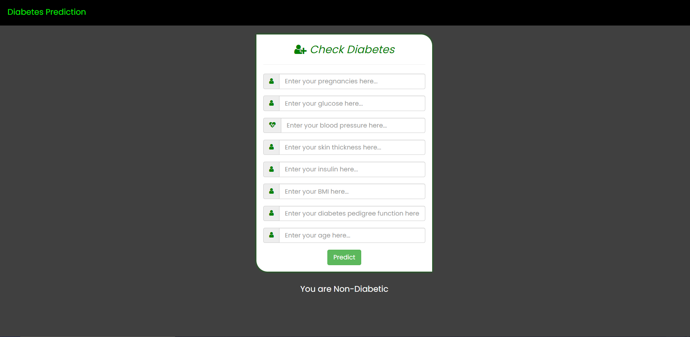

# Diabetes Prediction Using ANN
In this use case it will check whether person is having diabetes or not. To check diabetes there are different parameters like Glucose, Blood Pressure, Insulin, Skin Thickness, etc.

## Work Flow:
- Data Collection
    - Collected diabetes dataset from kaggle.
    - Dataset Link: https://www.kaggle.com/datasets/mathchi/diabetes-data-set
    - The data have Pregnancies, Glucose, BloodPressure, SkinThickness, Insulin, BMI, DiabetesPedigreeFunction, Age, and Outcome.
        - Pregnancies: Number of times pregnant
        - Glucose: Plasma glucose concentration a 2 hours in an oral glucose tolerance test
        - BloodPressure: Diastolic blood pressure (mm Hg)
        - SkinThickness: Triceps skin fold thickness (mm)
        - Insulin: 2-Hour serum insulin (mu U/ml)
        - BMI: Body mass index (weight in kg/(height in m)^2)
        - DiabetesPedigreeFunction: Diabetes pedigree function
        - Age: Age of person (years)
        - Outcome: Whether person have diabetes or not
- Data Pre-processing
    - Get some basic information about the data.
    - Check if there is any null values or not and if there is then apply different ways to handle null values.
- Data Analysis
    - Get statistical measures of the dataset.
    - Created charts or graphs for analyzing data like check distribution of data, outliers in data, etc.
- Model Creation
    - Implemented feature engineering like feature scaling and handling imbalanced dataset.
    - Created model using ANN(Artificial Neural Network) architecture using Tensorflow and Keras.
- Model Evaluation
    - Evaluated model using accuracy score, confusion matrix, precision, and recall.
- Creating Web App using Flask
    - Created simple UI using flask framework.
- Run the Web App using Docker
    - Created docker image of web app and run it into docker container.

## Screenshots
<table>
    <thead>
        <tr>
            <th>Home Page</th>
        </tr>
    </thead>
    <tbody>
        <tr>
            <td></td>
        </tr>
    </tbody>
</table>

## Run web app in Docker
Run following commands to run app in docker.
```powershell
docker build -t diabetespredictionapp .
docker run -p 8000:8000 diabetespredictionapp
```

## Tools & Technologies Used
- Python
- Flask
- Tensorflow, Keras
- Pandas, Numpy, Matplotlib